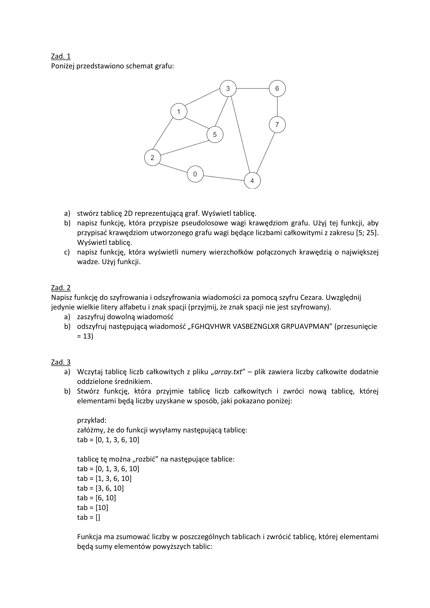

## **ZADANIA**

## 

## 

## **SCREENY TERMINALA**

#### zadanie 1

## 

#### zadanie 2

## 

#### zadanie 3

## 

#### zadanie 4

## 

old:

## 

#### zadanie 5

## 

old:

## 

created by [xcvrys/Kamil Ryś](https://github.com/xcvrys)
